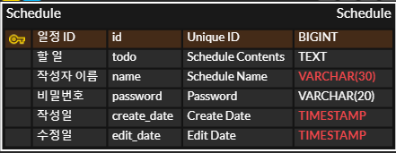
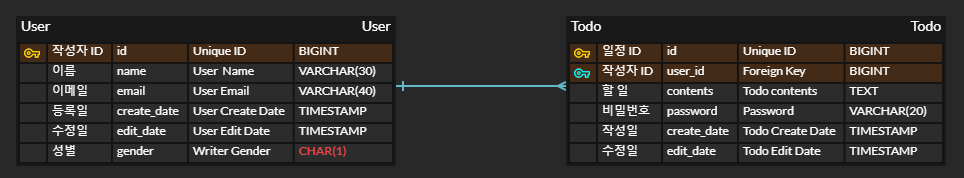

# Todo


---

## Lv 0. API 명세 및 ERD 작성

### Requirement

- [X] API 명세서 작성
- [X] ERD 작성
- [X] SQL 작성

#### Definition

- [X] API 명세서 작성
    - [X] 일정 API 설계
        - [X] 일정 생성(등록)
        - [X] 전체 일정 조회
        - [X] 특정 일정 조회
        - [X] 특정 일정 수정
        - [X] 특정 일정 삭제
- [X] ERD 작성
    - [X] todo
        - [X] id : 일정 아이디 / BIGINT / (PK)
        - [X] name : 일정 작성자 / VARCHAR(30)
        - [X] password : 비밀번호 / VARCHAR(20)
        - [X] create_date : 작성일 / TIMESTAMP
        - [X] edit_date : 수정일 / TIMESTAMP
- [X] SQL 작성

#### API 명세서

|    기능     | HTTP Method |                    URL                     |                          request                           |       Response       | HTTP Status |
|:---------:|:-----------:|:------------------------------------------:|:----------------------------------------------------------:|:--------------------:|:-----------:|
| 일정 생성(등록) |  **POST**   |                  `/todos`                  |      request body를 통해 할일, 작성자명, 비밀번호를 담아 보내 일정 등록 요청.      |  등록 정보 JSON 데이터 반환   |  `200 OK`   |
| 전체 일정 조회  |   **GET**   | `/todos?name={name}&edit_date={edit_date}` |           조건에 맞는 모든 일정을 조회.(조건 미존재 시, 전체 일정 조회)            | 조건에 해당하는 JSON 데이터 반환 |  `200 OK`   |
| 특정 일정 조회  |   **GET**   |            `/todos/{todos_id}`             |             query parameter로 ID 지정 후 선택 일정 조회.             | 조건에 해당하는 JSON 데이터 반환 |  `200 OK`   |
| 특정 일정 수정  |   **PUT**   |            `/todos/{todos_id}`             | query parameter로 ID를 지정하고 request body에 데이터를 담아 기존 데이터 수정. |  수정 정보 JSON 데이터 반환   |  `200 OK`   |
| 특정 일정 삭제  | **DELETE**  |            `/todos/{todos_id}`             |             query parameter로 ID 지정 후 선택 일정 삭제.             |       응답 코드 반환       |  `200 OK`   |

[**Swagger** 사용](http://localhost:8080/swagger-ui.html)

local에서 해당 프로젝트 실행 후 위 링크 통해 확인 가능.


#### ERD 작성



#### SQL 작성

```mysql
CREATE TABLE todo
(
    id          BIGINT AUTO_INCREMENT PRIMARY KEY COMMENT '일정 식별자',
    contents    TEXT COMMENT '할 일',
    name        VARCHAR(30) COMMENT '작성자',
    password    VARCHAR(20) COMMENT '비밀 번호',
    create_date TIMESTAMP COMMENT '작성일',
    edit_date   TIMESTAMP COMMENT '수정일'
);
```

---

## Lv 1. 일정 생성 및 조회

### Requirement

- 일정 생성
    - 할일, 작성자명, 비밀번호, 작성/수정일을 저장
    - 작성/수정일은 날짜와 시간을 모두 포함한 형태
    - 각 일정의 고유 식별자(ID)를 자동으로 생성하여 관리
    - 최초 입력시, 수정일과 작성일은 동일
- 전체 일정 조회
    - 다음 조건을 바탕으로 등록된 일정 목록을 전부 조회
        - 수정일(형식 : YYYY-MM-DD)
        - 작성자명
    - 조건 중 한 가지만 충족하거나, 둘다 충족을 하지 않을 수도, 두 가지를 모두 충족할 수도 있음.
    - 수정일 기준 내림차순으로 정렬하여 조회
- 선택 일정 조회
    - 선택한 일정 단건의 정보를 조회
    - ID를 사용하여 조회

#### Configuration

- [X] 일정 Entity
    - [X] 필드
        - id
        - 할일
        - 작성자명
        - 비밀번호
        - 작성/수정일

- [X] 일정 Controller
    - [X] 일정 생성 메서드
        - PostMapping 사용
        - RequestBody 로 데이터를 가져옴
        - 일정 Service 통해 일정 저장 후 return
    - [X] 전체 일정 조회 메서드
        - GetMapping 사용
        - RequestParam을 통해 수정일, 작성자명 데이터를 가져옴
        - 일정 Service 통해 조건에 맞는 일정을 List로 가져와 return
    - [X] 특정 일정 조회 메서드
        - GetMapping 사용
        - PathVariable통해 id 값 가져옴
        - 일정 Service 통해 id값에 맞는 일정 가져와 return

- [X] 일정 RequestDto
    - id, 작성일, 수정일 제외 데이터 사용
- [X] 일정 ResponseDto
    - 전체 데이터 사용

- [X] 일정 Service
    - [X] 일정 ServiceImpl
        - [X] 일정 저장 메서드
            - 일정 객체 생성
            - 생성한 객체를 사용해 일정 Repository에 저장 요청 후 반환 값return
        - [X] 전체 일정 조회 메서드
            - 들어온 조건을 사용해 일정 Repository에 일정 조회 요청 후 반환 값 return
        - [X] 특정 일정 조회 메서드
            - 들어온 id값을 사용해 일정 Repository에 일정 조회 요청 후 반환 값 return

- [X] 일정 Repository
    - [X] 일정 RepositoryImpl
        - [X] 일정 저장 메서드
            - JDBC 테이블 및 컬럼 설정
            - 파라미터를 들어온 값을 사용해 설정
            - JDBC에 저장한 이후 Key 값을 받음
            - Key값 과 들어온 데이터를 반환
        - [X] 전체 일정 조회 메서드
            - 특정 조건에 해당하는 데이터를 JDBC에서 query를 사용해 받아와 반환
        - [X] 특정 일정 조회 메서드
            - 특정 id에 해당하는 데이터를 JDBC에서 query를 사용해 받아와 반환

___

## Lv 2. 일정 수정 및 삭제

### Requirement

- 선택한 일정 수정
    - 선택한 일정 내용 중 할일, 작성자명 만 수정 가능
        - 서버에 일정 수정을 요청할 때 비밀번호를 함께 전달 (작성한 사용자가 맞는지 검증)
        - 작성일은 변경할 수 없고, 수정일은 수정 완료 시, 수정한 시점으로 변경

- 선택한 일정 삭제
    - 서버에 일정 삭제를 요청할 때 비밀번호를 함께 전달 (작성한 사용자가 맞는지 검증)

#### Configuration

- [X] 일정 Controller
    - [X] 일정 수정 메서드
        - PutMapping 사용
        - PathVariable 통해 id값 가져옴
        - RequestBody 로 데이터를 가져옴
        - 일정 Service 통해 id값에 맞는 일정 수정 후 return
    - [X] 일정 삭제 메서드
        - DeleteMapping 사용
        - PathVariable 통해 id값 가져옴
        - 일정 Service 통해 id값에 맞는 일정 삭제 후 return

- [X] 일정 Service
    - [X] 일정 ServiceImpl
        - [X] 일정 수정 메서드
            - 만약 할일, 작성자명이 비어있다면
                - 예외 처리 : BAD_REQUEST
            - 만약 id에 해당하는 일정이 존재하지 않는다면
                - 예외 처리 : NOT_FOUND
            - 만약 해당하는 일정의 비밀번호와 들어온 비밀번호가 다르다면
                - 예외 처리 : Unauthorized
            - 들어온 데이터를 사용해 일정 Repository에 일정 수정 요청 후 반환 값 return
        - [X] 일정 삭제 메서드
            - 만약 id에 해당하는 일정이 존재하지 않는다면
                - 예외 처리 : NOT_FOUND
            - 만약 해당하는 일정의 비밀번호와 들어온 비밀번호가 다르다면
                - 예외 처리 : Unauthorized
            - 들어온 데이터를 사용해 일정 Repository에 일정 삭제 요청 후 반환 값 return


- [X] 일정 Repository
    - [X] 일정 RepositoryImpl
        - [X] 일정 수정 메서드
            - 들어온 id값에 해당하는 데이터를 JDBC에서 query를 사용해 받아와 수정 후 반환
        - [X] 일정 삭제 메서드
            - 들어온 id값에 해당하는 데이터를 JDBC에서 query를 사용해 받아와 삭제

___

## Lv 3. 연관 관계 설정

### Requirement

** Schedule을 Todo로 일괄 변경**

- 작성자와 일정의 연결
    - 동명이인의 작성자가 있어 어떤 작성자가 등록한 `할 일` 인지 구별 할 수 없음
        - 작성자를 식별하기 위해 이름으로만 관리하던 작성자에게 고유 식별자를 부여
        - 작성자를 할 일과 분리하여 관리
        - 작성자 테이블을 생성하고, 일정 테이블에 FK를 생성해 연관관계를 설정
    - 조건
        - 작성자는 이름 외에 이메일, 등록일, 수정일 정보를 가지고 있음
            - 작성자의 정보는 추가로 받을 수 있음
        - 작성자의 고유 식별자를 통해 일정이 검색이 될 수 있도록 전체 일정 조회 코드 수정
        - 작성자의 고유 식별자가 일정 테이블의 외래키가 될 수 있도록 구현

#### ERD

- [X] 작성자 ERD
    - id : 작성자 아이디 / BIGINT / (PK)
    - name : 작성자 이름 / VARCHAR(30)
    - email : 작성자 이메일 / VARCHAR(40)
    - create_date : 작성자 등록일 / TIMESTAMP
    - edit_date : 작성자 수정일 / TIMESTAMP
    - gender : 성별(추가) / CHAR(1) : 'M', 'F'로 저장

- [X] 스케줄 ERD
    - id : 일정 아이디 / BIGINT / (PK)
    - writer_id : 작성자 아이디 / BIGINT / (FK)
    - password : 비밀번호 / VARCHAR(20)
    - create_date : 작성일 / TIMESTAMP
    - edit_date : 수정일 / TIMESTAMP

- 전체 ERD
  

#### SQL

```mysql
CREATE TABLE user
(
    id          BIGINT AUTO_INCREMENT PRIMARY KEY COMMENT '작성자 식별자',
    name        VARCHAR(30) COMMENT '작성자',
    email       VARCHAR(40) COMMENT '비밀 번호',
    create_date TIMESTAMP COMMENT '등록일',
    edit_date   TIMESTAMP COMMENT '수정일',
    gender      CHAR(1) COMMENT '성별'
);

CREATE TABLE todo
(
    id          BIGINT AUTO_INCREMENT PRIMARY KEY COMMENT '일정 식별자',
    contents    TEXT COMMENT '할 일',
    user_id     BIGINT COMMENT '작성자 식별자',
    password    VARCHAR(20) COMMENT '비밀 번호',
    create_date TIMESTAMP COMMENT '작성일',
    edit_date   TIMESTAMP COMMENT '수정일',
    FOREIGN KEY (user_id) REFERENCES user (id)
);
```

#### Configuration

- [X] 작성자 Entity
    - [X] 필드
        - id / Long
        - 이름 / String
        - 이메일 / String
        - 등록일 / LocalDateTime
        - 수정일 / LocalDateTime
        - 성별 / ENUM

- [X] 성별 ENUM
    - M, F 존재

- [X] 작성자 RequestDto
    - id, 작성일, 수정일 제외 데이터 사용
- [X] 작성자 ResponseDto
    - 전체 데이터 사용

- [X] 작성자 Controller
    - [X] 작성자 생성 메서드
        - PostMapping 사용
        - RequestBody 로 데이터를 가져옴
        - 작성자 Service 통해 작성자 저장 후 return

- [X] 작성자 Service
    - [X] 작성자 ServiceImpl
        - [X] 작성자 저장 메서드
            - 작성자 객체 생성
            - 생성한 객체를 사용해 일정 Repository에 저장 요청 후 반환 값 return

- [X] 작성자 Repository
    - [X] 작성자 RepositoryImpl
        - [X] 작성자 저장 메서드
            - JDBC 테이블 및 컬럼 설정
            - 파라미터를 들어온 값을 사용해 설정
            - JDBC에 저장한 이후 Key 값을 받음
            - Key값 과 들어온 데이터를 반환
        - [X] 작성자 수정 메서드
            - 들어온 id 값에 해당하는 데이터를 JDBC에서 query를 사용해 받아와 수정 후 반환

- [X] 일정 Controller
    - [X] 전체 일정 조회 메서드
        - 작성자의 id값을 통해 일정이 검색이 될 수 있도록 구현
            - id값을 이름 데이터 대신 사용, RequestParam으로 받음
            - 일정 Service 통해 조건에 맞는 일정을 List로 가져와 return
    - [X] 일정 수정 메서드
        - name 부분을 User 엔티티로 이동하였기 때문에, userId값과 name을 통한 수정 구현

- [X] 일정 Service
    - [X] 일정 ServiceImpl
        - [X] 전체 일정 조회 메서드
            - 만약 작성자 id, 수정일이 비어있다면
                - 예외 처리 : BAD_REQUEST
            - 만약 작성자 id, 수정일이 존재한다면
                - findTodos()
            - 만약 작성자 id만 존재한다면
                - findTodoByUserId()
            - 만약 수정일만 존재한다면
                - findTodoByEditDate()
            - 들어온 데이터를 사용해 일정 Repository에 전체 일정 조회 후 반환 값 return
        - [X] 일정 수정 메서드
            - 들어온 userId, name을 사용해 작성자 Repository에서 수정


- [X] 일정 Repository
    - [X] 일정 RepositoryImpl
        - [X] 전체 일정 조회 메서드
            - findTodos()
                - Writer id와 edit_date 사용하여 쿼리 검색
            - findTodoByUserId()
                - Writer id 사용하여 쿼리 검색
            - findTodoByEditDate()
                - Edit_date 사용하여 쿼리 검색
            - 각 조건에 맞는 쿼리 작성 후 스케줄 List 반환

___

## Lv 4. 페이지네이션

### Requirement

- 많은 양의 데이터를 효율적으로 표시하기 위해 데이터를 여러 페이지로 나누는 작업
    - 페이지 번호와 페이지 크기를 쿼리 파라미터로 전달하여 요청하는 항목을 나타냄
    - 전달받은 페이지 번호와 크기를 기준으로 쿼리를 작성하여 필요한 데이터만을 조회하고 반환
- 조건
  - 등록된 일정 목록을 페이지 번호와 크기를 기준으로 모두 조회
  - 조회한 일정 목록에는 작성자 이름이 포함
  - 범위를 넘어선 페이지를 요청하는 경우 빈 배열을 반환
  - Paging 객체 활용

#### Configuration

- [X] 일정 Controller
    - [X] 페이징 일정 조회 메서드(GET)
        - 페이지 번호와 크기를 Query Parameter로 받아옴
        - 위 두개의 데이터를 Pageable 객체를 사용해 저장하고, 일정 service에 보내 데이터 요청
        - 기존 전체 일정 조회 메서드를 제거하고, 해당 메서드를 통해 전체 일정 조회 가능하도록 설정
          - userId값 통해 특정 작성자만 조회 할 수 있도록 구현

- [X] 일정 Service
    - [X] 일정 ServiceImpl
        - [X] 페이징 일정 조회 메서드
            - 받아온 Pageable 객체를 일정 repository에 넘겨준 후 반환된 데이터 return


- [X] 일정 Repository
    - [X] 일정 RepositoryImpl
        - [X] 페이징 일정 조회 메서드
            - 받아온 Pageable 에서 pageSize, pageNumber, offset 값을 구함
            - pageSize와 offset을 통해 List 형식으로 Todo 리스트를 반환 받음
            - List 형식으로 저장된 Todo 리스트를 PageImpl을 통해 Page화 시켜 반환

___

## Lv 5. 페이지네이션

### Requirement

- 에외 상황에 대한 처리를 위해 HTTP 상태 코드와 에러 메시지를 포함한 정보를 사용하여 예외 처리
  - 필요에 따라 사용자 정의 예외 클래스를 생성하여 예외 처리를 수행 가능
  - @ExceptionHandler를 활용하여 공통 예외 처리를 구현 가능
  - 예외가 발생할 경우 적절한 HTTP 상태 코드와 함께 사용자에게 메시지를 전달하여 상황 관리
- 조건
  - 수정, 삭제 시 요청할 때 보내는 비밀번호가 일치 하지 않을 때 예외 발생
  - 선택한 일정 정보를 조회할 수 없을 때 예외 발생
    - 잘못된 정보 조회
    - 이미 삭제된 정보 조회

#### Configuration

- [X] 수정, 삭제 시 요청할 때 보내는 비밀번호가 일치 하지 않을 때 예외 발생
- [X] 선택한 일정 정보를 조회할 수 없을 때 예외 발생
    - [X] 잘못된 정보 조회
- [X] 수정, 삭제 시 존재하지 않는 할일, 유저를 수정, 삭제하도록 요청 받았을 때 예외 발생
- [X] 할일, 유저 등록시 필수 데이터가 들어오지 않았을 때 예외 발생

- [X] Enum 클래스 생성해 에러코드 저장
  - ErrorCode 클래스 생성
    - TODO_SAVE_BAD_REQUEST(400,"할일 등록시 내용, 유저 아이디, 비밀번호가 존재해야 합니다.")
    - TODO_UPDATE_DATA_BAD_REQUEST(400,"할일 수정시 내용, 유저 아이디가 존재해야 합니다.")
    - INVALID_PASSWORD(400,"할일 수정시 비밀번호가 일치해야 합니다.")
    - TODO_UPDATE_ID_BAD_REQUEST(400,"존재하는 할일만 수정 가능합니다.")
    - USER_SAVE_BAD_REQUEST(400,"유저 등록시 이름, 이메일, 성별이 존재해야 합니다.")
    - USER_UPDATE_DATA_BAD_REQUEST(400,"유저 정보 수정시 이름, 이메일이 존재해야 합니다.")
    - USER_UPDATE_ID_BAD_REQUEST(400,"존재하는 유저만 수정 가능합니다.")

- [X] CustomException 생성
  - ErrorCode를 사용하기 위한 CustomException class 생성

- [X] GlobalException 생성
  - CustomException을 사용하여 에러코드를 통해 에러를 처리하기 위한 class 생성

**참고**

[@ExceptionHandler를 통한 예외처리](https://velog.io/@kiiiyeon/%EC%8A%A4%ED%94%84%EB%A7%81-ExceptionHandler%EB%A5%BC-%ED%86%B5%ED%95%9C-%EC%98%88%EC%99%B8%EC%B2%98%EB%A6%AC)

[Springboot Exception Handling(스프링부트 exception 핸들링)](https://samtao.tistory.com/42)
___

## Commit Convention

### 형식

```
type(scope) : short summary

[body]

[footer]
```

<br>type : 커밋의 목적
<br>scope : 변경된 코드의 범위
<br>short summary : 커밋의 간략한 설명
<br>body : 커밋의 자세한 설명
<br>footer : 부가 정보

### type

<br>feat: 새로운 기능 추가.
<br>fix: 버그 수정.
<br>docs: 문서 수정 (README.md, 주석 등).
<br>style: 코드 포맷팅, 세미콜론 누락 등 기능에 영향을 미치지 않는 변경.
<br>refactor: 코드 리팩토링 (기능 변화 없음).
<br>test: 테스트 코드 추가/수정.
<br>chore: 빌드 프로세스 또는 패키지 매니저 설정 수정.
<br>perf: 성능 개선을 위한 변경.
<br>ci: CI 설정 변경.
<br>build: 빌드 관련 파일 변경.

#### Type Emoji

✨ : feat
<br>🐛 : fix
<br>📝 : docs
<br>🎨 : style
<br>🔨 : refactor
<br>🚀 : perf
<br>✅ : test
<br>📦 : chore
<br>🗑️ : delete
---

## Code Convention

<br>class name : PascalCase(ex: MyClass)
<br>method and var : camelCase(ex: userName)
<br>const : UPPER_SNAKE_CASE(ex: MAX_LENGTH)

class : 명사형
<br>interface : 형용사 or 명사형
<br>method : 동사형
<br>var : 명사형, 의미 알수 있도록 명확히
<br>들여 쓰기 : 4칸
<br>중괄호 : 한 줄 아래에서 시작
<br>공백 : 연산자, 피연산자 사이에 공백 사용 ex : total = price + tax; / calculateTotal(price, tax);

주석 : 가능하면 JavaDoc 형식 사용

코드 : 클래스 내부 코드는 const, field, constructor, method 순으로 작성

---